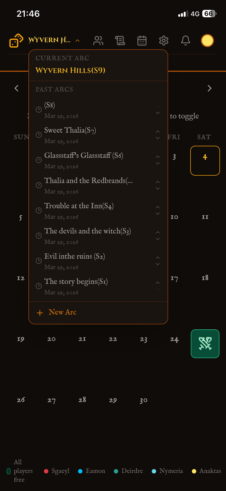
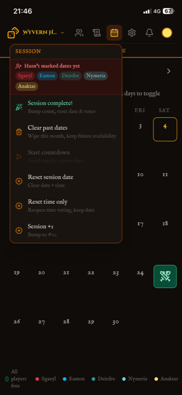
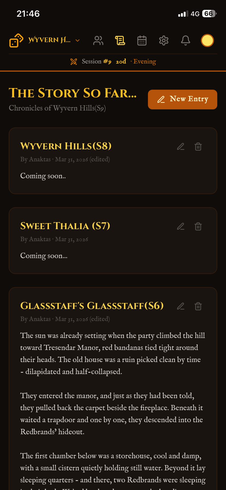
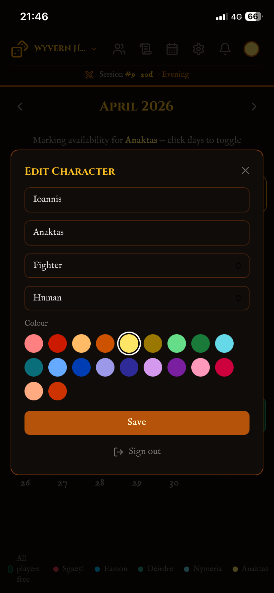
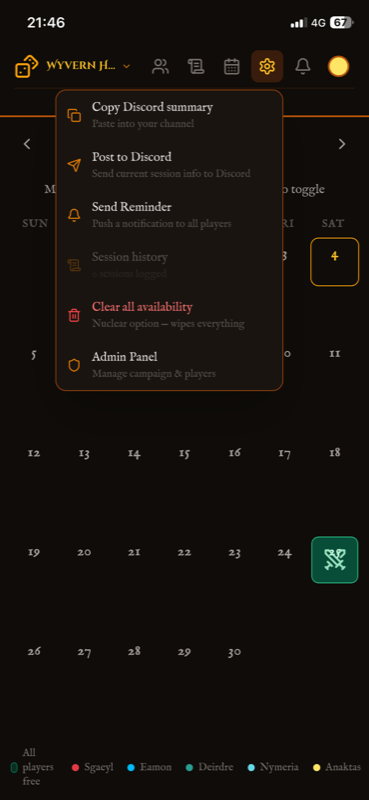

# ⚔️ DnD Planner

A mobile-first PWA built for our DnD group to coordinate session scheduling, track availability, and manage campaign info.

> 🔒 Private app — not open for public use.

## Screenshots

  

## Features

### 🗓️ Availability Calendar
Players mark free dates, green cells show when everyone's available. Confirmed session dates are highlighted with a swords icon.

  

### ⚔️ Session Planning
Countdown to next session in the navbar, plus group polls to find the best date and time.

  

### 📖 The Story So Far
Campaign blog and session log — track arcs and keep a record of your adventure.

  

### 🎲 Character
Your character persists across all devices via Google sign-in.

  

### 💬 Discord Integration
Post session info directly to your server via webhook.

  

### More Features
- 🔔 **Notifications** — in-app reminders from the DM
- 🛡️ **Admin panel** — manage players, roles, campaign settings
- 📱 **PWA** — installable on mobile, works like a native app
- 🔐 **Google sign-in** — authentication across devices

## Tech Stack

- React + TypeScript
- Firebase (Firestore + Auth + Hosting)
- Tailwind CSS
- Vite + PWA plugin
